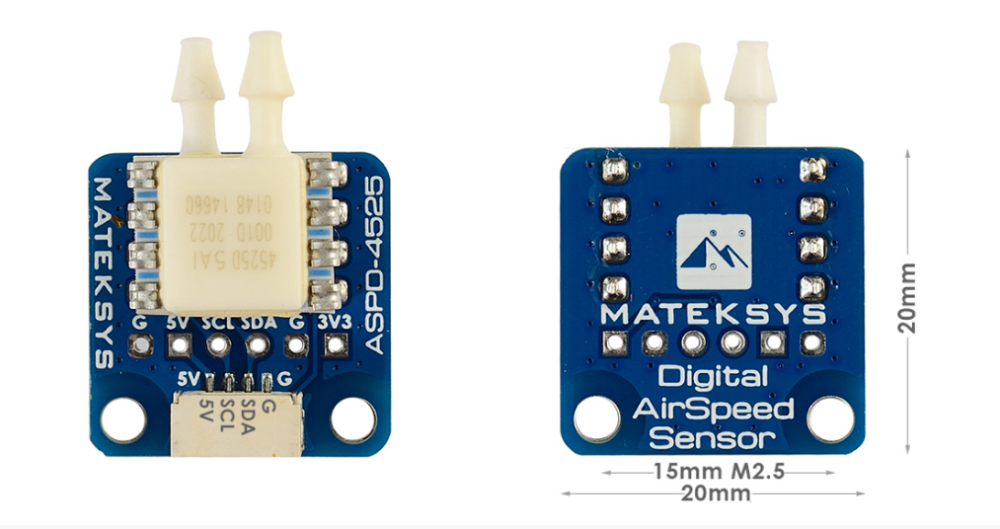

For better performance during autonomous take-offs and landings, an airspeed sensor is essential as it provides the flight controller with airspeed. Without it, the flight controller relies solely on the speed calculated by its GPS which can cause stalls in windy conditions. The airspeed sensor also enable efficient flights as it provides data to modulate the throttle during flights. 

Skypiea uses a [Mateksys ASPD-4525 airspeed sensor](https://www.mateksys.com/?portfolio=aspd-4525). The airspeed sensor additionally requires a pitot tube to, well, get the air to the sensor. make sure the tube is facing straight into the air *outside* the fuselage. Skypiea adorns the airspeed sensor on its nose.

The airspeed sensor is conneced to the I2C2 port of the flight controller. It requires the following parameters:

| Parameter    | Value |
| ------------ | ----- |
| `ARSPD_TYPE` | 1     |
| `ARSPD_BUS`  | 0     |

## Initialization

It is essential to keep the airspeed sensor covered while powering up the flight controller on the field. During its first flight, set the `ARSPD_AUTOCAL` parameter to  `1` and switch it back to `0` after the flight to callibrate it. **After** the airspeed sensor has been callibrated, set the parameter `ARSPD_USE` to `1`.