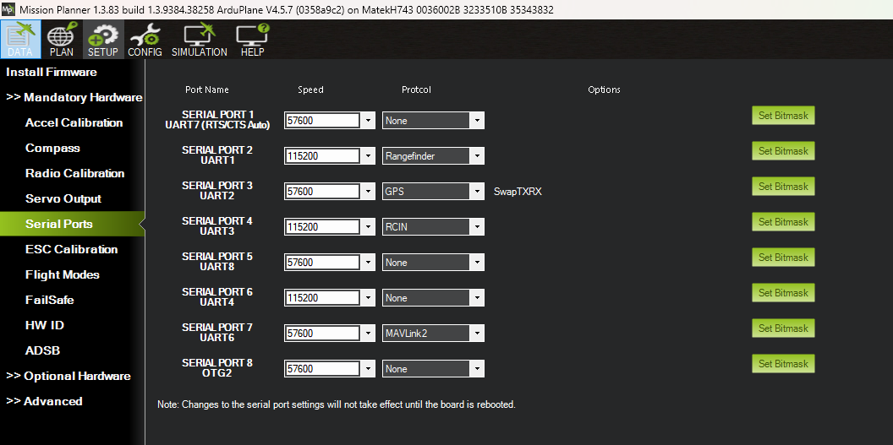

## Flight Controller Overview

The Mateksys H743 WLITE serves as the central avionics hub for Skypiea, coordinating all sensor inputs and control outputs. This section documents the complete wiring and configuration of peripherals to the flight controller.

## Serial Port Configuration

| Port     | UART  | Baud Rate | Peripheral                                                | Notes                        |
| -------- | ----- | --------- | ----------------------------------------------------------- | ----------------------------- |
| Serial 1 | UART7 | —         | Raspberry Pi                                               | Companion computer interface |
| Serial 2 | UART1 | 115200    | [Rangefinder](/docs/vehicles/skypiea/rangefinder)         | Lidar altimeter               |
| Serial 3 | UART2 | 57600     | GPS                                                        | SwapRxTx enabled              |
| Serial 4 | UART3 | —         | RCIN                                                       | Radio control input           |
| Serial 7 | UART6 | —         | MAVLink2                                                   | Telemetry/GCS link            |
| I2C2     | I2C   | —         | [Air speed sensor](/docs/vehicles/skypiea/airspeed-sensor) | Airspeed measurement          |

## Servo Outputs

| Output | Channel | Control Surface   | Purpose                    |
| ------ | ------- | ------------------ | --------------------------- |
| 3      | CH3     | Throttle (Left)    | Left engine throttle        |
| 4      | CH4     | Ground Steering    | Nose wheel steering         |
| 5      | CH5     | Throttle (Right)   | Right engine throttle       |
| 6      | CH6     | Aileron (Left)     | Left wing control           |
| 7      | CH7     | Aileron (Right)    | Right wing control          |
| 8      | CH8     | Flap (Left)        | Left flap deflection        |
| 9      | CH9     | Flap (Right)       | Right flap deflection       |
| 10     | CH10    | Rudder             | Tail yaw control             |
| 11     | CH11    | Elevator (Pitch)   | Pitch control (primary)     |
| 12     | CH12    | Elevator (Pitch)   | Pitch control (redundant)   |
