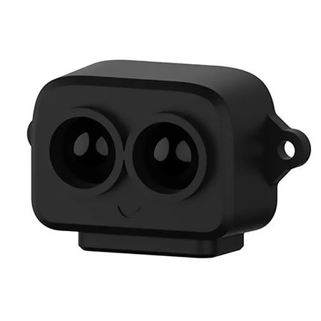

Skypiea uses a [Benewake TF-Luna](https://en.benewake.com/TFLuna/index.html) LiDAR for altitutde measurement. This LiDAR provides accurate distance upto 8m. This provides accurrate the flight controller with valuable information during takeoffs and landings.

The LiDAR is placed on the belly of the aircraft.

To enable the LiDAR, set the following parameters:

| Parameter    | Value |
| ------------ | ----- |
| `RNGFND1_TYPE` | 20  |
