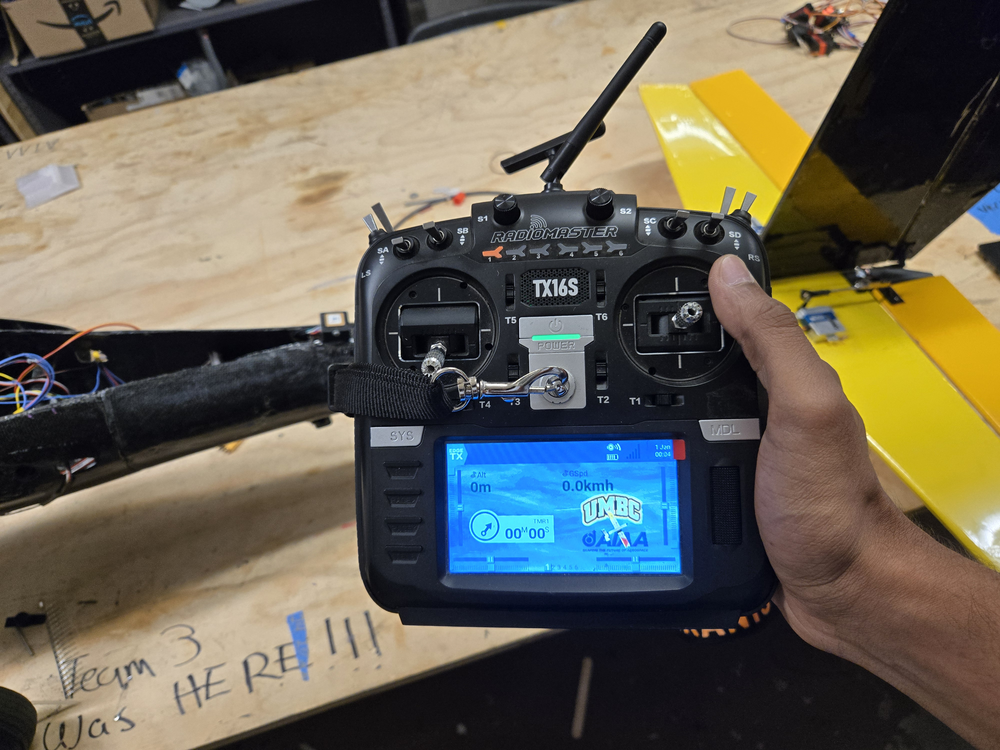
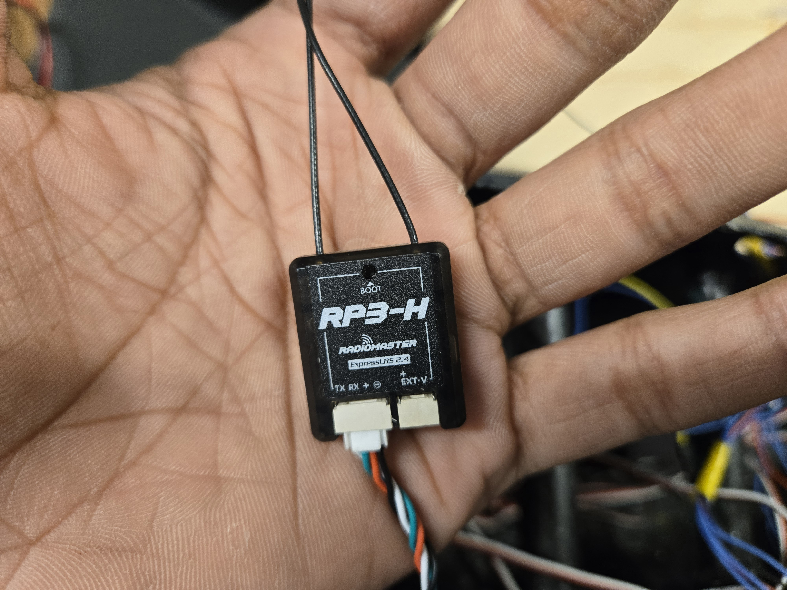
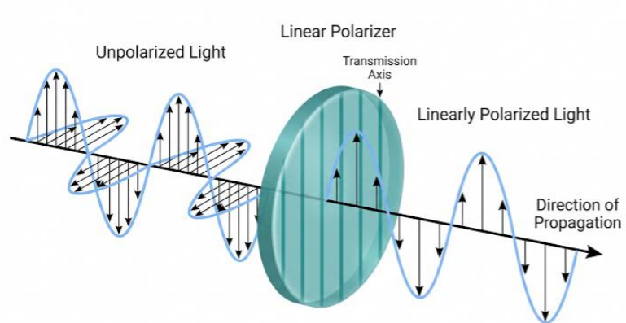

## Transmitter

The safety pilot of this UAV is equipped with a [RADIOMASTER TX16s](https://radiomasterrc.com/products/tx16s-mark-ii-radio-controller). The large amount of switches allow comfortable mapping and control over different functionalities of the plane. 

The channels on the transmitter are mapped as follows:

| Channel | Function |
|---------|----------|
| CH1 | Aileron |
| CH2 | Elevator |
| CH3 | Throttle |
| CH4 | Rudder |
| CH5 | ARM switch |
| CH6 | Return to launch |
| CH7 | Flaps |
| CH8 | Flight modes (up-manual, middle-FBWA, down-auto) |
| CH13 | Ground steering |

## RC Transmission
 The TX16s uses [ExpressLRS](https://www.expresslrs.org/) (ELRS). ELRS is an open-source, high-performance radio control link used for FPV drones, airplanes, and other remote-controlled models. It delivers extremely low latency, massive range, and full bidirectional telemetry at a low cost. 

 The TX16s requires an additional [RADIOMASTER Ranger Micro](https://radiomasterrc.com/products/ranger-micro-2-4ghz-elrs-module) in order to use ELRS. After attaching it to the back of the transmitter, going to:

  `MDL -> External RF -> selecting CRSF as Mode`

  Enables the use of the external backpack for RC controls.

  The specific settings for the Ranger Micro backpack can be changed in the Lua script that lives in 

  `SYS -> ExpressLRS`

### Setting a Bind Phrase
  1. On the ExpressLRS lua script, enable backpack Wifi.
  2. Go to the Wifi settings on your phone/laptop, connect to ExpressLRS. The password is `expresslrs`.
  3. Set a Bind Phrase of your choice. Keep this phrase a plaintext string that you can remember and keep it a secret.

## RC Receiver
  The Skypiea is equiped with a [RP3-H receiver](https://radiomasterrc.com/products/rp3-h-expresslrs-2-4ghz-nano-receiver). This receiver is very lightweight and easy to install. During testing, this receiver could be velcro'd anywhere inside the fuselage. 

### Receiver Antenna Direction

  The dual antenna need to be at a 90-degree angle from each other to provide maximum range. This is done to maximize range by preventing polarization mismatch and helps cover radiation nulls. Simple antennas have dead zones (called nulls) right at their very tips where the signal is weakest. If one antenna points directly at or away from a source and loses signal, the second antenna sits sideways to it, catching a strong signal.

  

### Binding the Receiver

  To bind the receiver, you need to:
  1. Keep the receiver powered until the LED flashed rapidly.
  2. Go to the Wifi settings on your phone/laptop, connect to ExpressLRS. The password is `expresslrs`.
  3. Go to `10.0.0.1` on the browser.
  4. Enter the same Bind Phrase set on your transmitter.
  5. Reboot.  

  The receiver should be bound with the transmitter now.

## Ardupilot Setup

  On ardupilot, set the `SERIALX_PROTOCOL` to `23`. Match the baudrate to whatever baudrate is selected on the receiver's web server.